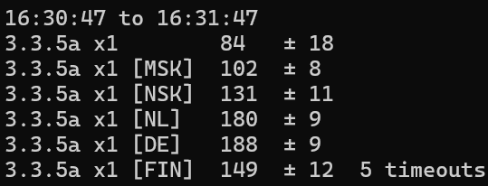
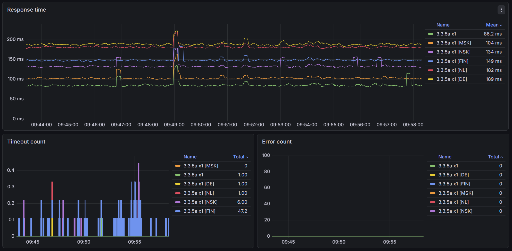

# wow-server-ping

| **🇬🇧 English** | [🇷🇺 Русский](README.ru.md) |
| :-: | :-: |

Ping tool for WoW 335a servers.

 

It can work as a Prometheus metrics exporter and display graphics in Grafana:



## Usage

### Downloads

For Windows you can find builds on the [Release page](https://github.com/egoroof/wow-server-ping/releases/latest). Open an issue if you need another OS builds.

### Realm list

If you are interested in `WoW Circle 3.3.5a` you don't need to extract realm list - it's already included in the build. You can skip this step.

You will need to extract realm list first. Wow servers can give you realm list only after login, so you will have to enter your username and password. This project comes with `realmlist.exe` utility, which logins to WoW server similar real WoW game client and save realm list to `servers` folder.

Run with your user and server host:

```
realmlist.exe user@host
```

If you worry about your credentials you can also run Wireshark, login in your WoW client and extract realmlist yourself.

### Ping

Simple example, which  loads realm list from `servers/logon.wowcircle.me.json` file, sends ping requests and print statistics every 30 seconds:

```
wow-ping.exe -servers logon.wowcircle.me
```

You can filter servers by regexp with `-filter` option:

```
wow-ping.exe -servers logon.wowcircle.me -filter "x4"
```

Windows builds comes with some `.bat` files which you can use or make similar for you.

### Available settings

| Flag | Default | Description |
|---|---|---|
| `-servers` | `logon.wowcircle.me` | Servers config from `servers` folder |
| `-port` | - | Listen port for Prometheus metrics |
| `-timeout` | `1s` | Ping timeout |
| `-interval` | `500ms` | Sleep time between requests |
| `-stats-interval` | `30s` | How often stats should be printed to console |
| `-stats` | - | How many stats to display before exit |
| `-filter` | - | Regexp for filter servers by name |

## Antivirus reaction

Some antivirus software can detect malware (false positive) in downloaded Windows release and block download. You can add an exception and try to download it again. This tool doesn't have any malware. You can check source code and compile it yourself with golang. Also you can scan it with VirusTotal.
